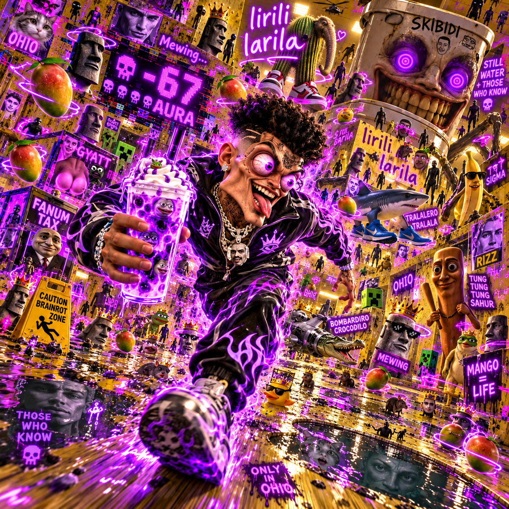

MADD GOOF AF woke up in ohio at exactly 3:33am after hearing mango phonk blasting from inside the walls, but instead of checking what was happening, bro instantly started mewing because his winter arc was already cooked and his aura balance was sitting at negative 999999. Then the skibidi rizzler final boss kicked down the door, fanum taxed his grimace shake, stole his low taper fade, and hit him with the forbidden german stare while a level 1000 gyatt goblin started aura farming in the hallway. MADD GOOF AF tried to escape through the backrooms, but every door led to more ohio, more still water, and increasingly violent Balkan rage edits playing at 200% volume. Bro activated sigma mode, whispered “those who know,” and attempted the ancient jamaican smile technique, but the ohio council immediately detected illegal levels of rizz and deployed seventeen NPCs with subway surfers gameplay under their faces. At that exact moment, mango mango mango started echoing through the ceiling and the fanum tax department confiscated his remaining 3 aura. MADD GOOF AF then unlocked forbidden mewing maxxing ultra instinct, edged the rizz singularity for six consecutive hours, and challenged the skibidi overlord to a 1v1 aura battle. Unfortunately, the overlord had premium sigma battle pass, infinite gyatt, and a 900-day mewing streak, so MADD GOOF AF got spiritually cooked, physically fanum taxed, emotionally ratioed, and teleported into the Ohio Backrooms Season 7 Battle Royale. His final words were “nah bro I’m still sigma,” right before a giant grimace shake exploded, mango phonk peaked, the Balkan rage meter reached 100%, and the entire universe lost 8 billion aura in one frame. 💀😭🙏

| |
| :-: |
|  |
